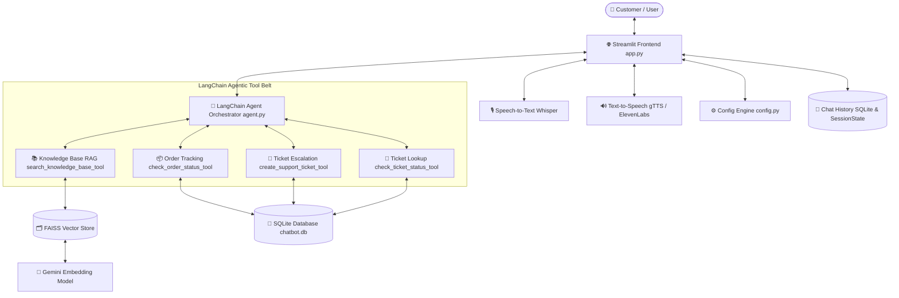

# 🤖 Date AI — Agentic AI Customer Support Platform
> **Comprehensive Architecture, Implementation & Framework Guide**  
> *A production-grade, multi-tool Agentic AI Customer Support Agent powered by Gemini 3.6 Flash, LangChain, FAISS RAG, SQLite Persistence, Whisper Audio Intelligence, and Streamlit.*

---

## 📌 1. Project Overview
**Date AI Customer Support Assistant** is an autonomous, agentic AI platform designed to handle complex customer support workflows end-to-end. Unlike simple chatbot wrappers, this application uses **Agentic AI Architecture** powered by Google's Gemini models and LangChain function-calling tools.

The agent autonomously plans, decides which tools to execute (knowledge base search, order status lookups, support ticket creation), evaluates information quality, manages persistent chat threads, and translates responses into 14 languages with optional Text-to-Speech (TTS) voice generation.

---

## 🏗️ 2. High-Level System Architecture



---

## 🦜 3. LangChain Framework Integration

LangChain serves as the core framework for agent reasoning, tool binding, vector indexing, and message management.

| LangChain Module | Location | Purpose & Implementation Details |
| :--- | :--- | :--- |
| `ChatGoogleGenerativeAI` | `agent.py` | Connects to Gemini (`gemini-3.6-flash`) for LLM reasoning and native tool invocation. |
| `@tool` Decorator (`langchain_core.tools`) | `agent.py` | Converts Python functions into structured tool definitions with schemas for Gemini function calling. |
| `llm.bind_tools()` | `agent.py` | Binds the array of 4 tools (`AGENT_TOOLS`) directly to the LLM instance. |
| `HumanMessage`, `AIMessage`, `SystemMessage`, `ToolMessage` | `agent.py` | Manages the multi-turn agent conversation trajectory and tool execution outputs. |
| `GoogleGenerativeAIEmbeddings` | `utils.py` | Generates 768-dimensional vector embeddings using `models/gemini-embedding-2`. |
| `FAISS` (`langchain_community.vectorstores`) | `utils.py` | In-memory and disk vector store for sub-millisecond similarity retrieval with L2 distance scoring. |
| `RecursiveCharacterTextSplitter` | `utils.py` | Chunks raw documentation text into 1,000-character segments with 200-character overlap. |
| `TextLoader` | `utils.py` | Loads raw `.txt` policy files from the `uploads/` folder into LangChain `Document` objects. |

---

## 💬 4. 2-Layer Chat History & Session Architecture

Chat history is managed using a dual-layer strategy: fast in-memory rendering for UI responsiveness, backed by persistent SQLite storage across browser restarts.

### Layer 1: In-Memory Runtime State (`st.session_state`)
- `st.session_state.session_id`: Unique UUID identifying the active conversation thread.
- `st.session_state.chat_history`: Array of message objects rendered in real-time:
  ```json
  [
      {"role": "user", "content": "How do I request a refund?"},
      {"role": "assistant", "content": "You can request a refund under Settings > Billing..."}
  ]
  ```

### Layer 2: Persistent SQLite Storage (`chatbot.db`)
Located in [database.py](file:///c:/Users/darsh/OneDrive/Desktop/Date-AI-Chatbot-Cust_Support_Chatbot-main/database.py):

#### `chat_sessions` Table
| Column | Type | Constraints | Description |
| :--- | :--- | :--- | :--- |
| `session_id` | `TEXT` | `PRIMARY KEY` | Session UUID |
| `title` | `TEXT` | `DEFAULT 'New Chat'` | Conversation title derived from the first user query |
| `created_at` | `TEXT` | `NOT NULL` | ISO timestamp of session creation |
| `updated_at` | `TEXT` | `NOT NULL` | ISO timestamp of last activity |

#### `chat_messages` Table
| Column | Type | Constraints | Description |
| :--- | :--- | :--- | :--- |
| `id` | `INTEGER` | `PRIMARY KEY AUTOINCREMENT` | Unique message ID |
| `session_id` | `TEXT` | `FOREIGN KEY -> chat_sessions` | Associated chat session |
| `role` | `TEXT` | `NOT NULL` | `"user"` or `"assistant"` |
| `content` | `TEXT` | `NOT NULL` | Message text content |
| `agent_reasoning` | `TEXT` | `NULLABLE` | JSON log of tools executed during reasoning |
| `audio_path` | `TEXT` | `NULLABLE` | Path to generated TTS audio file |
| `timestamp` | `TEXT` | `NOT NULL` | ISO timestamp |

---

## 💾 5. Database Schema (Orders & Support Tickets)

### `orders` Table (`chatbot.db`)
Pre-seeded with sample order records for order tracking:
| Column | Type | Description | Sample Data |
| :--- | :--- | :--- | :--- |
| `order_id` | `TEXT PRIMARY KEY` | Order identifier | `ORD-1001` |
| `customer_name` | `TEXT` | Customer full name | `Alice Johnson` |
| `product` | `TEXT` | Purchased product/plan | `Date AI Pro Plan (Annual)` |
| `status` | `TEXT` | Order fulfillment status | `delivered`, `shipped`, `processing` |
| `order_date` | `TEXT` | Date of purchase | `2026-06-15` |
| `tracking_number` | `TEXT` | Carrier tracking ID | `TRK-98765432` |
| `carrier` | `TEXT` | Shipping carrier | `FedEx`, `UPS` |

### `support_tickets` Table (`customer_support.db`)
Stores tickets generated by `create_support_ticket_tool`:
| Column | Type | Description | Sample Data |
| :--- | :--- | :--- | :--- |
| `ticket_id` | `TEXT PRIMARY KEY` | Auto-generated ticket ID | `TKT-A3F8` |
| `issue` | `TEXT` | Issue description | `User requested manual refund` |
| `priority` | `TEXT` | Priority level | `low`, `medium`, `high`, `urgent` |
| `status` | `TEXT` | Ticket resolution status | `open`, `in_progress`, `closed` |

---

## 📁 6. Complete Repository Structure & File Matrix

| File / Folder | Role & Purpose | Key Technical Details |
| :--- | :--- | :--- |
| **`config.py`** | Central Model Configuration | Defines `GEMINI_MODEL = "gemini-3.6-flash"` and `EMBEDDING_MODEL = "models/gemini-embedding-2"`. |
| **`agent.py`** | Agentic AI Orchestrator | Contains `get_agent_response()`, tool bindings via `@langchain_tool`, system prompts, and tool execution routines. |
| **`utils.py`** | RAG Vectorstore & Audio Utilities | Manages FAISS vectorstore indexing, OpenAI Whisper STT (`transcribe_audio_bytes`), and gTTS/ElevenLabs audio TTS. |
| **`database.py`** | Data Persistence Layer | Manages SQLite connection pooling, tables initialization, order lookups, and session storage. |
| **`app.py`** | Main Application Entry & UI Loop | Renders chat window, sidebar controls, multilingual engine (`deep_translator`), and voice recorder widget. |
| **`ui.py`** | Custom Interface & Rendering | Functions for welcome cards, chat avatars (`🧑`/`🤖`), agent reasoning expander cards, and CSS injection. |
| **`styles.css`** | Modern Theme & Styling Rules | Dark mode CSS rules, circular blue send button (`➔`), and right-aligned microphone icon positioning. |
| **`uploads/`** | Documentation Knowledge Source | Stores company policy `.txt` files (`01_company_info.txt`, `02_faq_troubleshooting.txt`, `03_refund_cancellation_policy.txt`). |
| **`vectorstore/`** | FAISS Vector Index Storage | Stores pre-indexed FAISS binary vectors for sub-millisecond similarity retrieval. |
| **`PROJECT_INFO.md`**| Comprehensive Project Documentation | Complete technical architecture reference guide. |
| **`requirements.txt`**| Python Dependencies | `streamlit`, `langchain-google-genai`, `faiss-cpu`, `openai-whisper`, `gTTS`, `deep-translator`. |
| **`packages.txt`** | System Package Dependencies | `portaudio19-dev` for audio hardware compatibility on Linux / Streamlit Cloud. |

---

## 🧠 7. Step-by-Step Execution Pipeline

### Step 1: User Input (Text or Voice)
1. **Text Input**: User submits text via the styled bottom input box (`st.chat_input`).
2. **Voice Input**: User clicks the microphone icon embedded inside the chat bar. OpenAI Whisper (`tiny` model cached via `@st.cache_resource`) transcribes audio bytes to text instantly.

### Step 2: Multilingual Translation Engine
If a non-English language (Spanish, French, Hindi, Gujarati, German, etc.) is selected in the sidebar:
- `deep_translator` translates the input text to English before sending it to the agent.
- Agent reasoning occurs in English, and the output is translated back to the target language before rendering.

### Step 3: Autonomous Agentic Reasoning & Tool Dispatch
The agent evaluates the query against system instructions and dispatches tools:
- **`search_knowledge_base_tool`**: Searches FAISS vectorstore for company policy information.
- **`check_order_status_tool`**: Queries SQLite `orders` table for tracking details.
- **`create_support_ticket_tool`**: Creates a support ticket in SQLite if information is missing or customer requests escalation.
- **`check_ticket_status_tool`**: Looks up existing ticket status by `TKT-XXXX` ID.

### Step 4: High-Speed RAG Retrieval Pipeline
1. `_retrieve_documents()` queries the FAISS vectorstore using Gemini vector embeddings.
2. Direct FAISS L2 similarity distance checks verify document relevance in sub-milliseconds (**~1.5 second total latency**).

### Step 5: Output Generation & Text-to-Speech (TTS)
1. Response is rendered in the chat stream with an option to expand **Agent Reasoning** logs.
2. If TTS is enabled, `generate_tts()` generates MP3 audio via gTTS (or ElevenLabs) for voice playback.

---

## 🚀 8. Installation & Deployment Guide

```bash
# 1. Clone repository
git clone https://github.com/Darshan8128/Customer_Support_Agent.git
cd Customer_Support_Agent

# 2. Configure Environment Variables in .env
GOOGLE_API_KEY=your_gemini_api_key_here

# 3. Install Python Dependencies
pip install -r requirements.txt

# 4. Launch Streamlit Application
streamlit run app.py
```
