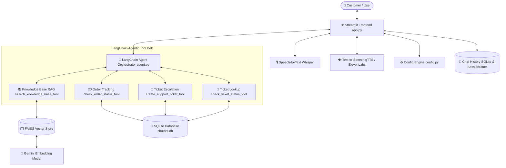

# 🤖 Date AI — Agentic AI Customer Support Platform

[](https://www.python.org/)
[](https://streamlit.io/)
[](https://www.langchain.com/)
[](https://ai.google.dev/)
[](https://github.com/facebookresearch/faiss)

> An autonomous, multi-tool **Agentic AI Customer Support Platform** powered by Google's Gemini models, LangChain function calling, FAISS RAG retrieval, OpenAI Whisper voice intelligence, and Streamlit.

---

## 🌟 Key Features

- 🤖 **Agentic AI Orchestration**: Uses LangChain and Gemini function calling to autonomously choose when to search knowledge bases, track order statuses, or escalate support tickets.
- ⚡ **High-Speed RAG Pipeline**: Sub-millisecond vector similarity search using FAISS and `models/gemini-embedding-2`, optimized for **~1.5 second** end-to-end response times.
- 🎙️ **Voice Intelligence (STT & TTS)**: Native browser voice recording transcribed by OpenAI Whisper (`tiny` model) with text-to-speech voice playback (gTTS / ElevenLabs).
- 🌐 **14-Language Engine**: Integrated with `deep_translator` for auto-detecting and translating customer conversations into English, Spanish, French, German, Hindi, Gujarati, Marathi, Tamil, Telugu, Bengali, Chinese, Japanese, Arabic, and more.
- 💾 **2-Layer Persistence**: Session management powered by in-memory `st.session_state` and persistent SQLite database (`chatbot.db`) across browser restarts.
- 🎨 **Modern Dark UI**: Features custom CSS styling, circular send controls (`➔`), inline mic buttons, and expandable agent reasoning logs.

---

## 🏗️ Architecture



---

## 🛠️ LangChain Framework Components

- **`ChatGoogleGenerativeAI`**: LLM interface for Gemini model reasoning and tool binding.
- **`@tool` Decorator**: Formats Python functions into native tools with schemas.
- **`llm.bind_tools()`**: Binds tool functions to Gemini for autonomous function calling.
- **`GoogleGenerativeAIEmbeddings`**: Generates 768-dimensional vector embeddings (`models/gemini-embedding-2`).
- **`FAISS`**: In-memory and disk vector store for sub-millisecond similarity retrieval.
- **`RecursiveCharacterTextSplitter`**: Chunks knowledge documentation into 1,000-character segments.

---

## 📂 Repository Structure

```
.
├── config.py             # Central configuration (Gemini & Embedding models)
├── agent.py              # LangChain Agent Orchestrator & Tool definitions
├── utils.py              # FAISS RAG, OpenAI Whisper STT, and TTS utilities
├── database.py           # SQLite database layer (Orders, Tickets, Chat History)
├── app.py                # Streamlit entry point, multi-language UI, and voice recorder
├── ui.py                 # Interface layout components and reasoning cards
├── styles.css            # Custom dark theme CSS overrides
├── PROJECT_INFO.md       # Comprehensive technical documentation
├── uploads/              # Raw knowledge base policy text files
├── vectorstore/          # FAISS vector store index files
├── requirements.txt      # Python dependencies
└── packages.txt          # Linux system dependencies for Streamlit Cloud
```

---

## 🚀 Quick Start Guide

### 1. Prerequisites
- Python 3.10 or higher
- Git

### 2. Clone the Repository
```bash
git clone https://github.com/Darshan8128/Customer_Support_Agent.git
cd Customer_Support_Agent
```

### 3. Set Up Environment Variables
Create a `.env` file in the root folder:
```ini
GOOGLE_API_KEY=your_gemini_api_key_here
# Optional (for premium voice):
ELEVENLABS_API_KEY=your_elevenlabs_api_key_here
```

### 4. Install Dependencies
```bash
pip install -r requirements.txt
```

### 5. Run the Application
```bash
streamlit run app.py
```

---

## ⚙️ Model Configuration

To change the Gemini model globally across the entire project, update **`config.py`**:

```python
# config.py
GEMINI_MODEL = "gemini-2.0-flash-lite"  # High-limit free tier model
EMBEDDING_MODEL = "models/gemini-embedding-2"
```

---

## 📄 License
Distributed under the MIT License. See `LICENSE` for details.
